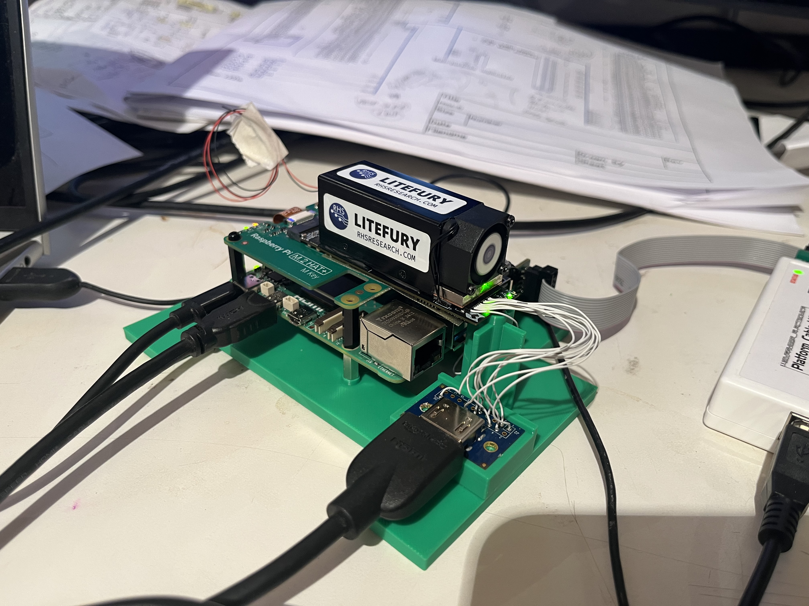
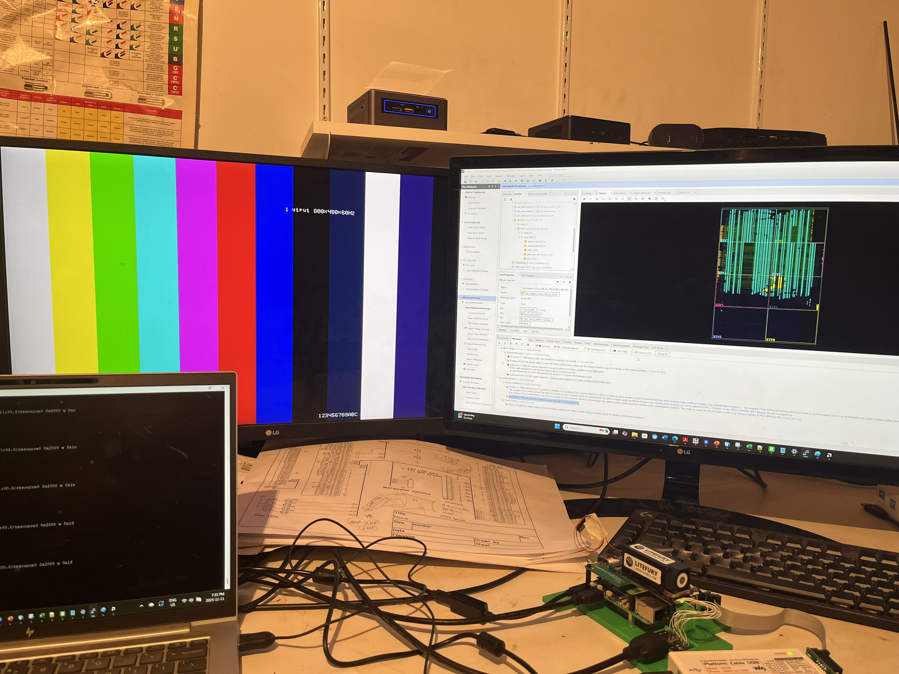

# Litefury 

My xilinx Artix-7 dev system for PCIe devlopment. It uses a LiteFury mounted to a raspberry Pi5 with M.2 slot.
I've incorporated my standard HDMI video output. I've brought up the pcie interface
without drivers directly accessing via: lspci, setpci, pcimem commands.

The HDMI was ported from my altera platform. It gives unlimited observability into the raw hardware. For bringup I just
have color bars with ascii/hex/binary active text overlays. I still have to port over the font rom and overlay ram,
especially to give the github commit id into the frame (and not affect synthesis results).
Its is relatively low overhead, with the hdmi and overlay generation hightlighted in the floorplan on the right

For HDMI output I used the 4x 2.5V LDVS pairs on the DF52 connector wired up to a HDMI breakout connector board.

# orginial Nitefury readme below
-------------------

# NiteFury and Litefury: Xilinx FPGA development board kit in M.2 form factor

Ever wanted to work with FPGA, and connect to DDR and PCI express without spending a small fortune?

NiteFury and Litefury are compact, full-featured FPGA developement boards featuring a decent size FGPA, DDR3, and PCI express connectivity in a small form factor, for a low price.

## Features and general specifications
- Xilinx FPGA
- Onboard DDR3 with 1.6GB/s bandwidth
- Onboard configuration flash (S25FL series)
- PCIe x4 gen 2 interface to FGPA (2GB/s)
- IO: 4x LVDS pairs and 4 general purpose
- 4 user controlled LEDs
- External I/O via I/O connector: 12 Total, 4 selectable analog or digital
- External I/O via PCIe connector: 1x 3.3V digital I/O (LED), SMBus
- 10W VCCINT supply
- Dimensions: 22x80x28mm

## Specifications
| Feature | Nitefury-II | Litefury |
| --- | --- | --- |
| FPGA | XC7A200T-2FBG484E | XC7A100T-L2FGG484E |
| RAM | 1GB DDR3-800 | 512MB DDR3-800 |
| Flash | 256Mb | 128Mb, 256Mb |

## Block Diagram

# Images

## Where to buy

- [RHS Research store](https://rhsresearch.com)
- [Amazon Litefury] (https://www.amazon.com/dp/B08BKSVJH5)
- [Amazon Nitefury] (https://www.amazon.com/dp/B0B9FMBF6C)

## Important note on JTAG connections

If you have the original, single-connector JTAG adapter, it only works with the "white" JTAG cable. As shown here

If you have the new dual-connector JTAG adapter, be careful to connect the cable properly. 
If you have a white JTAG cable, it will connect to the connector labelled "WHT"
If you have a black JTAG cable, it will connect to the connector labelled "BLK"

As shown:

## More information

info@nanoevb.com
